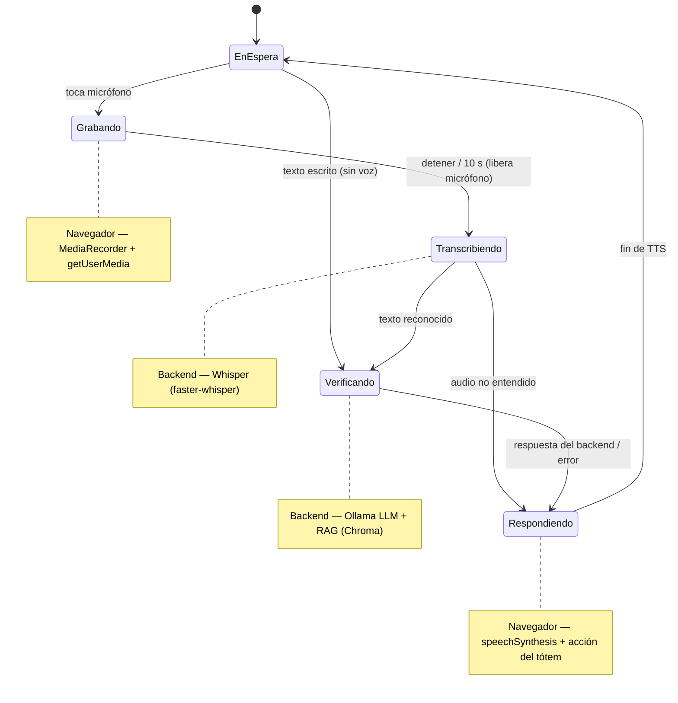

# Arquitectura y UI/UX — SoftiaGuard Assistant

> Cubre el **Objetivo específico 2** (arquitectura tecnológica + interfaz UI/UX). Parte de la
> especificación en [`../CLAUDE.md`](../CLAUDE.md).
> Convención de estado: ✅ Implementado · 🟡 Parcial / Simulado · ⏳ Objetivo / Pendiente.

## 1. Diagrama de componentes

```
Navegador (tótem)                    Docker                          Host / Red
┌──────────────────────┐     ┌───────────────────────┐      ┌───────────────────────┐
│ Frontend React       │     │ frontend :3000        │      │ Ollama (nativo, GPU)  │
│ - UI del tótem       │     │  Express proxy /api ─────────▶│  LLM  qwen2.5:7b      │
│ - UI Libro Visitas   │──/api──▶ backend :8000       │──────▶│  Embeddings bge-m3    │
│ - TTS speechSynthesis│     │  FastAPI              │ 11434 └───────────────────────┘
│ - STT MediaRecorder  │     │  - RAG (ChromaDB)     │      ┌───────────────────────┐
└──────────────────────┘     │  - STT Whisper local  │      │ Soft-IA (REST) ⏳     │
                             └───────────────────────┘      │  residentes/eventos   │
                                       │                    └───────────────────────┘
                                 ChromaDB (./data)
```

- **Voz de salida (TTS)**: en el navegador (Web Speech API). ✅
- **Voz de entrada (STT)**: el navegador graba un clip y lo envía a `/api/transcribe`; **Whisper
  local** lo transcribe. El audio no sale a la nube. ✅
- **Decisión de acceso**: LLM local (Ollama) + RAG (ChromaDB) en `/api/verify`. ✅
- **Ollama corre nativo en el host** para usar GPU/Metal (en macOS la GPU no está disponible
  dentro de Docker); los contenedores lo alcanzan vía `host.docker.internal`. ✅
- **Soft-IA**: sistema externo del condominio, integración REST. ⏳

## 2. Flujos de datos

### `POST /api/verify` (decisión de acceso) ✅
1. **`find_apartment`** — resolución determinista del apartamento por teclado, patrón `NN[AB]` en
   el mensaje, o nombre del propietario (`backend/app/rag.py`).
2. **`retrieve_context`** — recuperación semántica de políticas/procedimientos relevantes en
   ChromaDB (`k = RAG_TOP_K = 3`); la consulta combina el mensaje + estado/notas del apartamento.
3. **`build_messages`** — arma el prompt del "Vigilante Virtual" con el contexto inyectado
   (`backend/app/prompt.py`).
4. **`llm.generate`** — Ollama con salida JSON forzada (`format=VERIFY_JSON_SCHEMA`,
   `temperature=0.2`, `num_ctx=4096`).
5. **Refuerzo** — si se resolvió el apartamento, se completan `apartment`/`owner` con el dato
   autoritativo. Ante error → `ERROR_RESPONSE` de contingencia.

### `POST /api/verify-qr` (código QR de invitación de Soft-IA) ✅
El QR lo genera **Soft-IA** y contiene una URL:
`https://<dominio>/app/control/detalles_visitante/<id_b64>?d=<json_b64>`, donde `d` es un JSON en
base64 con los datos de la visita, incluido el **`id` de la autorización**. Flujo:
1. El navegador decodifica el QR con jsQR y envía la URL como `{ code }`.
2. `backend/app/qr.py` **parsea** la URL y extrae el payload (el `id`).
3. `backend/app/invitations.py` busca ese `id` en el **libro mayor** `data/invitations.json` (el
   **estado real** de las autorizaciones del condominio) y decide con el registro almacenado:
   `vetado == 0`, `estatus == "activo"`, `autorizado_hasta` vigente y, si se configura
   `CONDOMINIO_ID`, `idcondominios` correcto.
4. Devuelve un `VerifyResponse` (válido → `open_gate`/`success`; no registrado/vetado/inactivo/
   vencido/otro condominio → `DENIED`/`show_error`).
5. Si se autoriza (y `SOFTIA_ENABLED`), **registra la visita en Soft-IA** en segundo plano
   (RF-14, `app/events.py`), sin bloquear la apertura del portón.

> **Seguridad:** la decisión se toma con el libro mayor, **no** con los campos del QR (que van en
> base64 sin firma y son falsificables). Un QR manipulado que diga "activo" se **deniega** si el
> registro real está vetado/inactivo. En producción, ese libro mayor debe ser/consultar a
> **Soft-IA** por `id` (RF-15, ⏳).

### Recolección de datos faltantes antes de autorizar ✅
Una autorización puede estar incompleta. La **compuerta** `app/access.py` (reutilizada por QR y voz)
detecta los faltantes de {nombre, cédula, teléfono} y dirige un diálogo:
1. **Identificación** — por QR (`id`) o por **nombre** (`/api/identify`, con desambiguación de
   homónimos: primero por cédula, luego por apartamento).
2. Si faltan datos → `GateResponse` con `status: NEED_INFO`, `missing` y `auth_id`; el frontend
   recoge el dato y reenvía a `/api/identify` (acumulando). El **teléfono** se pide por voz/teclado;
   la **cédula** se muestra a la cámara → `/api/verify-cedula` (OCR Tesseract, `app/ocr.py`) que
   extrae el número y **verifica el nombre** (coincidencia difusa) contra la autorización.
3. Con los datos completos → **PATCH a Soft-IA** (`softia.update_autorizacion`, solo campos
   permitidos) + actualización del libro mayor local → `check_state` → APPROVED/DENIED.
Estados/acciones nuevos: `Status.NEED_INFO`, `Action.collect_info`, `Action.show_id_scanner`;
modelo `GateResponse` (VerifyResponse + `missing`, `auth_id`). El LLM (`/api/verify`) puede enrutar
un invitado que se identifica por voz devolviendo `action: collect_info`.

> **OCR:** la fiabilidad de Tesseract sobre cédulas reales es limitada; la verificación de nombre es
> best-effort y admite reintento.

### Solicitud de acceso por WhatsApp (visitante sin autorización) 🟡
Cuando el visitante **no tiene autorización vigente** (no existe, vencida o inactiva), el tótem no
deniega: ofrece enviar una **solicitud al propietario** por WhatsApp **a través de Soft-IA** (RF-20…23).
Los vetados, los de otro condominio y los inmuebles "No Molestar" se siguen denegando sin solicitud.

```
Visitante ─ nombre / [Soy invitado] ─► /api/identify
   ├─ autorización válida ────────────► APPROVED / open_gate
   ├─ vetado / otro condominio ───────► DENIED
   └─ no existe / vencida / inactiva ─► NEED_INFO (request_mode=true)
Recolección (un dato por turno): apartment → nombre → cédula (OCR) → teléfono → motivo (opcional)
   ▼
POST /api/access-request ─► softia.create_solicitud ─► Soft-IA ─WhatsApp─► Propietario [Aprobar][Rechazar]
   ▼  (Soft-IA no responde → DENIED "No pude contactar al residente")
PENDING_CONFIRMATION / await_owner {request_id, expires_in}
Tótem: banner con cuenta regresiva + Cancelar; GET /api/access-request/{id} cada 3 s
   ├─ aprobada  ─► upsert de la autorización de un día en invitations.json + RF-14 ─► APPROVED / open_gate
   ├─ rechazada ─► DENIED
   └─ expirada / cancelada ─► DENIED (+ PATCH cancelada a Soft-IA)
```

- **Privacidad:** el tótem **nunca** conoce el teléfono del propietario; envía `idpropietario`
  (sincronizado en `apartments.json`) y Soft-IA resuelve el destinatario.
- **Estado:** `app/access_requests.py` guarda las solicitudes en curso en
  `data/access_requests.json` (escritura atómica) y consulta Soft-IA como máximo cada
  `ACCESS_REQUEST_POLL_MIN_S` s; vence a los `ACCESS_REQUEST_TIMEOUT_S` s (120 por defecto).
- **Sin cola:** si Soft-IA no está disponible al crear la solicitud, se deniega; una solicitud que
  llega tarde no sirve (a diferencia de RF-14).
- **Modo simulado** (`SOFTIA_SOLICITUD_MOCK=true`, para desarrollo sin Soft-IA; en producción `false`):
  no se llama a Soft-IA; el botón del propietario se simula con `POST /api/dev/access-request/{id}/respond {"decision": "aprobada"|"rechazada"}`, que
  construye localmente la autorización de un día.

### `POST /api/transcribe` (STT) ✅
Recibe un clip de audio (`multipart/form-data`) → **faster-whisper** (`vad_filter`, `beam_size=5`,
carga perezosa) → `{ text }`. El modelo se descarga una vez y se cachea.

## 3. Decisiones de diseño

- **100% local / open-source**: privacidad (audio y datos no salen de la red del condominio) y sin
  costos ni dependencia de nube. Reemplazó un backend anterior basado en Google Gemini.
- **Ollama con salida estructurada**: `format` = JSON Schema derivado del modelo Pydantic
  (`VerifyResponse`), garantizando respuestas válidas que dirigen el tótem.
- **RAG híbrido**: *lookup* exacto para el apartamento (IDs se resuelven mejor por coincidencia
  exacta) + recuperación **semántica** para políticas/FAQ (escala al crecer la base de conocimiento).
- **STT local (Whisper)** en lugar de la Web Speech API del navegador (que envía audio a Google y
  requiere Internet), y **captura de micrófono con `MediaRecorder`** liberada al detener.
- **TTS de navegador**: sin trabajo de backend; la voz se sintetiza en el cliente.
- **Identidad configurable (multi-condominio)**: el nombre, la ubicación, los residentes y las
  políticas del condominio son **datos de configuración**, no valores fijos; el sistema se reutiliza
  en distintos condominios cambiando esa configuración. Hoy solo el frontend lo parametriza
  (`VITE_BUILDING_NAME`); el backend (prompt/knowledge/datos) debe parametrizarse — ver
  [requirements.md](requirements.md#8-deuda-técnica--inconsistencias-a-corregir). "Valle Blanco /
  Valencia" es únicamente el placeholder del proyecto.

## 4. Contratos de API

| Método | Ruta | Descripción | Estado |
|---|---|---|---|
| POST | `/api/verify` | Decisión de acceso (texto → JSON estructurado). | ✅ |
| POST | `/api/verify-qr` | Valida un código QR de invitación (`{ code }` → `GateResponse`). | ✅ |
| POST | `/api/identify` | Identifica por nombre + recolección de datos faltantes → `GateResponse`. | ✅ |
| POST | `/api/verify-cedula` | OCR de la cédula (imagen) → `{ cedula, match }`. | ✅ |
| POST | `/api/transcribe` | STT: audio → `{ text }`. | ✅ |
| GET | `/api/apartments` | Lista de apartamentos (paridad; el frontend no lo usa hoy). | ✅ |
| POST | `/api/access-request` | Crea una solicitud de acceso (WhatsApp vía Soft-IA) con los datos recogidos → `GateResponse` (`await_owner`). | ✅ |
| GET | `/api/access-request/{id}` | Estado de la solicitud (polling) → `GateResponse` (pendiente / aprobada / rechazada / expirada). | ✅ |
| DELETE | `/api/access-request/{id}` | El visitante cancela la espera. | ✅ |
| POST | `/api/dev/access-request/{id}/respond` | **Solo modo simulado**: simula el botón Aprobar/Rechazar del propietario. | ✅ (herramienta de desarrollo) |
| POST | `/api/sync` | Fuerza la sincronización con Soft-IA (además de la periódica). | ✅ |
| GET | `/health` | Estado y modelos configurados. | ✅ |

**`VerifyRequest`**: `{ message: string, history: {role, text}[], currentAptInput: string }`
(el historial usa `text`, no `content`).

**`VerifyResponse`**: `{ reply, apartment?, status, owner?, action, assistant_animation }`.

**`GateResponse`**: `VerifyResponse` + `{ missing?, auth_id?, request_mode?, request_id?, expires_in? }`.
`IdentifyRequest` acepta además `motivo` y `request_mode`; `AccessRequestCreate` =
`{ apartment, nombre, cedula, telefono, motivo? }`.

| Enum | Valores |
|---|---|
| `status` | `APPROVED` · `PENDING_CONFIRMATION` · `DENIED` · `IDENTIFYING` · `NEED_INFO` · `ERROR` |
| `action` | `open_gate` · `ring_bell` · `show_qr_scanner` · `collect_info` · `show_id_scanner` · `await_owner` · `none` · `show_error` |
| `assistant_animation` | `talking` · `scanning` · `idle` · `success` · `denied` |

**Proxy**: el frontend llama a `/api/*` (mismo origen); `frontend/server.ts` reenvía en *streaming*
a `BACKEND_URL` (soporta JSON y audio multipart). En local se usa `127.0.0.1` (no `localhost`, que
Node resuelve a IPv6 mientras uvicorn escucha en IPv4).

## 5. Modelo de datos y RAG

- **`backend/data/apartments.json`** — propietarios/residentes, campos `{ apt, owner, status, notes, idpropietario }`
  (`idpropietario` permite dirigir la solicitud de WhatsApp; **no** se sincronizan teléfonos).
  Se **alimenta desde Soft-IA** (endpoint de propietarios; apt=`codigo`, owner=`nombre`). ✅
- **`backend/data/invitations.json`** — **libro mayor de autorizaciones** del condominio: el
  estado real de cada invitación (`id`, `nombre`, `inmueble`, `propietario`, `idcondominios`,
  `autorizado_hasta`, `estatus`, `vetado`). El QR solo aporta el `id`; la decisión se toma con este
  registro (`app/invitations.py`). Se **alimenta desde Soft-IA** (endpoint de autorizaciones). ✅
- **`backend/knowledge/*.md`** — `politicas.md` (trato, estados, horario, deliveries, QR,
  emergencias) y `procedimientos.md` (mapa de decisión estado/acción/animación). ✅
- **Ingesta** (`python -m app.ingest`) — un documento por apartamento + *chunks* de los `.md`
  troceados por encabezados `##`; se persiste en ChromaDB (colección `politicas_edificio`,
  embeddings `bge-m3`). ✅
- **Recuperación** (`backend/app/rag.py`) — `find_apartment` (exacto) + `retrieve_context`
  (semántico). Degradación grácil: devuelve contexto vacío si el índice no existe. ✅

## 6. Integración con Soft-IA (sincronización offline-first)

Objetivo 3. En lugar de consultar Soft-IA en cada acceso, el backend **sincroniza** los datos a
archivos locales cada `SOFTIA_SYNC_INTERVAL` segundos, de modo que las verificaciones y
autorizaciones **funcionan aunque no haya conexión** a Soft-IA (offline-first, RNF-05). ✅

- **`app/softia.py`** — cliente HTTP (`httpx`). Autentica con `SOFTIA_LOGIN_PATH`
  (usuario+contraseña → token) y consulta con `Authorization: Bearer <token>`:
  `GET /api/condominio/{id}/propietarios` y `GET /api/condominio/{id}/autorizaciones`. También
  `POST .../visitas` (RF-14) y `PATCH .../autorizaciones/{auth}` (completar datos, RF-18).
  TLS y rutas/campos configurables por entorno.
- **`app/sync.py`** — mapea propietarios → `apartments.json` (apt=`codigo`, owner=`nombre`) y
  autorizaciones → `invitations.json` (id=`idautorizacionvisitas`, veto=`flag_vetado`, unidad/dueño
  por cruce con propietarios vía `idpropietario`). Escribe de forma **atómica** (`os.replace`) e
  invalida las cachés. Si Soft-IA no responde o devuelve vacío, **conserva los archivos locales**.
- **`app/events.py`** — **registro de visitas (RF-14)**: al autorizar un QR, hace
  `POST /api/condominio/{id}/visitas` con `{idpropietario, idvisita (=idautorizacionvisitas),
  autorizado_por, fecha, telefono}`. Se ejecuta en segundo plano (no bloquea la apertura del
  portón). Offline-first: si falla por **red/5xx** se **encola** en `data/pending_visitas.json` y se
  reintenta en cada sync; un **4xx** (vencida/no existe) se descarta (no se reintenta).
- **Solicitudes de acceso (RF-21)** 🟡 — implementado en Soft-IA y verificado de extremo a extremo
  (condominio 3304):
  - `POST /api/condominio/{id}/solicitud_acceso` `{idpropietario, inmueble, nombre, cedula, telefono,
    motivo, expira_en}` → `{idsolicitud, estatus:"pendiente"}`. `idpropietario` es obligatorio,
    `motivo` opcional y `expira_en` en **segundos**. La API de Soft-IA guarda la solicitud en
    `bas_solicitudes_acceso` y delega el envío de la plantilla de WhatsApp (botones Aprobar/Rechazar)
    al servicio de mensajería de Soft-IA; si el envío falla responde **502** (`error_envio`) y el
    tótem deniega con «no puedo contactar al residente».
  - `GET …/{sol}` → `{idsolicitud, estatus, autorizacion?}`. Una pendiente vencida se informa como
    `expirada` y `error_envio` como `cancelada`; al aprobar incluye la fila de `bas_autorizacionvisitas`
    (vigencia = hoy), que el tótem copia al libro mayor local. 404 si no existe; un 5xx transitorio no
    corta la espera (el tótem reintenta).
  - `PATCH …/{sol}` `{estatus:"cancelada"}` → 409 si ya no está pendiente.
  - **Pendiente** ⏳: el **webhook** que recibe los botones y crea la autorización (verificado hoy
    simulando la aprobación en la BD).
  - Rutas configurables (`SOFTIA_SOLICITUDES_PATH`, `SOFTIA_SOLICITUD_ITEM_PATH`); con
    `SOFTIA_SOLICITUD_MOCK=false` se usa Soft-IA real.
- **Ejecución** — tarea en segundo plano en el ciclo de vida de FastAPI (habilitada con
  `SOFTIA_ENABLED`), más `POST /api/sync` para forzar sync + reintento de la cola. También
  `python -m app.sync` (CLI).
- **Pendiente** ⏳ — auditar los accesos peatonales por LLM (no tienen `idvisita`) y la verificación
  de un token de sesión propia del backend.

El resto del flujo (`/api/verify`, `/api/verify-qr`) no cambia: siguen leyendo los archivos
locales, que ahora reflejan el estado de Soft-IA.

## 7. Interfaz (UI/UX)

> Dirección visual **«Videoportero Soft-IA»** (rediseño 2026-09-29; sustituye a «Libro de Visitas»,
> descartado): el tótem se presenta como el videoportero moderno del edificio, con la marca
> **SoftiaGuard (submarca de Soft-IA)**. Contexto de producto en `PRODUCT.md`; decisiones visuales
> en `DESIGN.md`.

**Orientación** ✅: **horizontal primero (1920×1080)** con adaptación a **vertical (1080×1920)**;
la orientación del hardware aún no está decidida.

**Layout del tótem** (`frontend/src/App.tsx`), dentro de un marco de aluminio: ✅
1. **Pantalla del Vigilante** — el **Vigilante Virtual como personaje ilustrado** con el trazo
   lineal del logo de Soft-IA, que reacciona a cada estado (atento, escuchando, pensando, hablando,
   contento, apenado, esperando). Junto a él, su frase en tipografía grande y lo que dijo el
   visitante. Una franja superior nombra siempre el **paso actual** y muestra condominio y hora.
2. **Panel de teclas** — placa de marca SoftiaGuard · Soft-IA, rejilla de altavoz y como máximo
   cuatro teclas grandes: **Hablar** (tecla de llamada naranja, protagonista), **Tengo código QR**,
   **Marcar apartamento**; en el marco inferior: Soy invitado, Ayuda y Emergencia.

**Resultados** ✅: la pantalla cambia la expresión del Vigilante y el panel enciende la
**tecla-indicador** con el color del estado (autorizado, no autorizado, en espera con cuenta
regresiva grande y Cancelar, sin conexión), con corchetes de enfoque, la ficha de la visita
(destino · visitante · estado) y el siguiente paso. Reinicio automático tras cada resultado.

**Día y noche** ✅: de día aluminio claro con grabado azul marino; de noche panel azul marino con
leyendas retroiluminadas en celeste. Por hora (`VITE_NIGHT_FROM`, `VITE_NIGHT_TO`, 18–6);
`?tema=dia|noche` fuerza una.

**Pendiente de reestilizar** 🟡: teclado de apartamento, pasos de datos, escáneres, ayuda y
emergencia conservan su lógica (teclado alfanumérico, un dato por paso, pánico con confirmación)
y se adaptan al nuevo mundo en una segunda ronda.

**Honestidad del estado** ✅: portón, intercomunicador, alerta y aviso al residente llevan la marca
«simulado»; el pánico pide confirmación; los controles de simulación solo aparecen con **`?demo`**.

**Accesibilidad** ✅: `lang="es"`, región `aria-live`, texto ≥ 24 px en el tótem, contraste alto,
`prefers-reduced-motion`; el estado nunca se comunica solo con color.

**Escáner de QR** (`frontend/src/components/QrScanner.tsx`): la cámara ocupa la página;
decodifica el QR con **jsQR** sobre un `<canvas>` frame a frame; al detectar un código llama a
`/api/verify-qr` y libera la cámara. Alternativa visible «Marcar apartamento» y tiempo límite. Se
abre desde «Tengo código QR» o cuando `/api/verify` devuelve `action = show_qr_scanner`. Requiere
**contexto seguro** (`localhost` o HTTPS). ✅

**Escáner de cédula** (`frontend/src/components/IdScanner.tsx`): misma cámara, **captura un
fotograma fijo** y lo envía a `/api/verify-cedula`. Se abre cuando la compuerta pide la cédula
(`action: show_id_scanner`); alternativa «Escribir el número». ✅

**Espera de la respuesta del propietario** (`action: await_owner`): tecla-indicador «EN ESPERA», cuenta
regresiva monumental y **Cancelar**; el frontend consulta `GET /api/access-request/{id}` cada 3 s y
muestra «sin conexión» si la consulta falla. ✅

> **Avatar 3D retirado.** La spec anterior marcaba ✅ un avatar FBX, pero el código dibujaba un orbe
> Three.js. En el rediseño el Vigilante es una presencia sobria (firma + indicador de estado); el
> modelo `assets/Security_Guard.fbx` queda en el repositorio sin uso.

**Ciclo de estados de la interacción por voz** (con feedback en cada fase):



| Fase | Feedback en la UI |
|---|---|
| **Grabando** (`isListening`) | ondas animadas + "Escuchando… Hable ahora" |
| **Transcribiendo** (`isTranscribing`) | puntos animados + "Entendiendo su mensaje…" |
| **Verificando** (`isProcessing`) | puntos animados + "Verificando su solicitud…" |
| **Respondiendo** | respuesta hablada (TTS) + acción del tótem |

> `getUserMedia` requiere contexto seguro: funciona en `localhost`; en producción por IP/dominio
> requiere **HTTPS**.

## 8. Despliegue

`docker-compose.yml` — servicios **frontend** (`:3000`, `npm run dev`) y **backend** (`:8000`,
`uvicorn`), con **Ollama nativo en el host** (`OLLAMA_HOST=http://host.docker.internal:11434`).
Volúmenes: código montado, vector store en `./data`, caché de Whisper en `./whisper_cache`.
Arranque: `ollama serve` + `ollama pull` de los modelos → `docker compose up --build` →
`docker compose exec backend python -m app.ingest`. Detalle operativo en el
[README raíz](../README.md).

## 9. Estado actual vs objetivo (por componente)

| Componente | Hoy | Objetivo |
|---|---|---|
| Interacción voz/texto | ✅ | — |
| STT (Whisper local) | ✅ | — |
| TTS (navegador) | ✅ | — |
| Decisión de acceso (LLM + RAG) | ✅ | — |
| Interfaz del tótem (Videoportero Soft-IA: inicio y resultados, horizontal/vertical, día/noche) | ✅ | 🟡 reestilizar teclado, pasos y escáneres |
| Datos de residentes y autorizaciones | ✅ sincronización Soft-IA → JSON local (offline-first) | — |
| Registro de visitas en Soft-IA (auditoría) | ✅ visitas por QR con cola de reintento (RF-14) | ⏳ auditar accesos peatonales por LLM |
| Escaneo y validación de QR | ✅ cámara (jsQR) + decisión con libro mayor `invitations.json` por `id` | — |
| Recolección de datos faltantes | ✅ diálogo `NEED_INFO` (nombre/cédula/teléfono) + OCR cédula (Tesseract) + PATCH a Soft-IA | ⏳ OCR de cédulas reales robusto |
| Solicitud de acceso por WhatsApp | 🟡 integrado con Soft-IA real: crear, enviar WhatsApp, consultar, vencer y cancelar ✅ | ⏳ webhook de los botones Aprobar/Rechazar en Soft-IA |
| Portón / intercomunicador / pánico | 🟡 simulados | ⏳ hardware + Soft-IA |
| Registro de eventos / auditoría | ⏳ | ⏳ Soft-IA |
| Autenticación / roles | ⏳ | ⏳ |
| Validación (latencia/usabilidad) | ⏳ | ⏳ simulacros |
