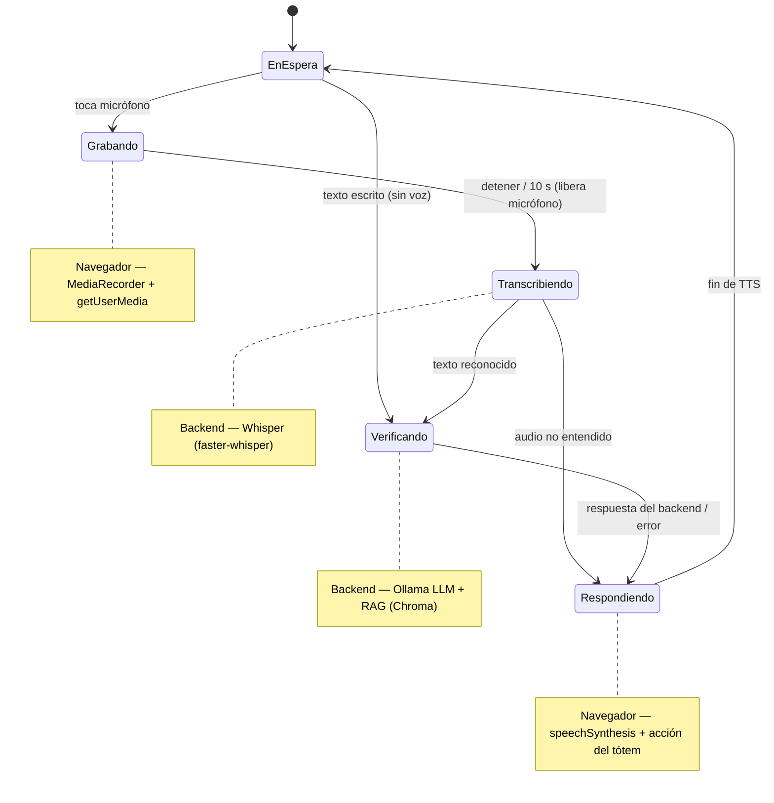

# Arquitectura y UI/UX — SoftiaGuard Assistant

> Cubre el **Objetivo específico 2** (arquitectura tecnológica + interfaz UI/UX). Parte de la
> especificación en [`../CLAUDE.md`](../CLAUDE.md).
> Convención de estado: ✅ Implementado · 🟡 Parcial / Simulado · ⏳ Objetivo / Pendiente.

## 1. Diagrama de componentes

```
Navegador (tótem)                    Docker                          Host / Red
┌──────────────────────┐     ┌───────────────────────┐      ┌───────────────────────┐
│ Frontend React       │     │ frontend :3000        │      │ Ollama (nativo, GPU)  │
│ - UI del tótem       │     │  Express proxy /api ─────────▶│  LLM  qwen2.5:7b      │
│ - Avatar 3D (Three)  │──/api──▶ backend :8000       │──────▶│  Embeddings bge-m3    │
│ - TTS speechSynthesis│     │  FastAPI              │ 11434 └───────────────────────┘
│ - STT MediaRecorder  │     │  - RAG (ChromaDB)     │      ┌───────────────────────┐
└──────────────────────┘     │  - STT Whisper local  │      │ Soft-IA (REST) ⏳     │
                             └───────────────────────┘      │  residentes/eventos   │
                                       │                    └───────────────────────┘
                                 ChromaDB (./data)
```

- **Voz de salida (TTS)**: en el navegador (Web Speech API). ✅
- **Voz de entrada (STT)**: el navegador graba un clip y lo envía a `/api/transcribe`; **Whisper
  local** lo transcribe. El audio no sale a la nube. ✅
- **Decisión de acceso**: LLM local (Ollama) + RAG (ChromaDB) en `/api/verify`. ✅
- **Ollama corre nativo en el host** para usar GPU/Metal (en macOS la GPU no está disponible
  dentro de Docker); los contenedores lo alcanzan vía `host.docker.internal`. ✅
- **Soft-IA**: sistema externo del condominio, integración REST. ⏳

## 2. Flujos de datos

### `POST /api/verify` (decisión de acceso) ✅
1. **`find_apartment`** — resolución determinista del apartamento por teclado, patrón `NN[AB]` en
   el mensaje, o nombre del propietario (`backend/app/rag.py`).
2. **`retrieve_context`** — recuperación semántica de políticas/procedimientos relevantes en
   ChromaDB (`k = RAG_TOP_K = 3`); la consulta combina el mensaje + estado/notas del apartamento.
3. **`build_messages`** — arma el prompt del "Vigilante Virtual" con el contexto inyectado
   (`backend/app/prompt.py`).
4. **`llm.generate`** — Ollama con salida JSON forzada (`format=VERIFY_JSON_SCHEMA`,
   `temperature=0.2`, `num_ctx=4096`).
5. **Refuerzo** — si se resolvió el apartamento, se completan `apartment`/`owner` con el dato
   autoritativo. Ante error → `ERROR_RESPONSE` de contingencia.

### `POST /api/transcribe` (STT) ✅
Recibe un clip de audio (`multipart/form-data`) → **faster-whisper** (`vad_filter`, `beam_size=5`,
carga perezosa) → `{ text }`. El modelo se descarga una vez y se cachea.

## 3. Decisiones de diseño

- **100% local / open-source**: privacidad (audio y datos no salen de la red del condominio) y sin
  costos ni dependencia de nube. Reemplazó un backend anterior basado en Google Gemini.
- **Ollama con salida estructurada**: `format` = JSON Schema derivado del modelo Pydantic
  (`VerifyResponse`), garantizando respuestas válidas que dirigen el tótem.
- **RAG híbrido**: *lookup* exacto para el apartamento (IDs se resuelven mejor por coincidencia
  exacta) + recuperación **semántica** para políticas/FAQ (escala al crecer la base de conocimiento).
- **STT local (Whisper)** en lugar de la Web Speech API del navegador (que envía audio a Google y
  requiere Internet), y **captura de micrófono con `MediaRecorder`** liberada al detener.
- **TTS de navegador**: sin trabajo de backend; la voz se sintetiza en el cliente.
- **Identidad configurable (multi-condominio)**: el nombre, la ubicación, los residentes y las
  políticas del condominio son **datos de configuración**, no valores fijos; el sistema se reutiliza
  en distintos condominios cambiando esa configuración. Hoy solo el frontend lo parametriza
  (`VITE_BUILDING_NAME`); el backend (prompt/knowledge/datos) debe parametrizarse — ver
  [requirements.md](requirements.md#8-deuda-técnica--inconsistencias-a-corregir). "Valle Blanco /
  Valencia" es únicamente el placeholder del proyecto.

## 4. Contratos de API

| Método | Ruta | Descripción | Estado |
|---|---|---|---|
| POST | `/api/verify` | Decisión de acceso (texto → JSON estructurado). | ✅ |
| POST | `/api/transcribe` | STT: audio → `{ text }`. | ✅ |
| GET | `/api/apartments` | Lista de apartamentos (paridad; el frontend no lo usa hoy). | ✅ |
| GET | `/health` | Estado y modelos configurados. | ✅ |

**`VerifyRequest`**: `{ message: string, history: {role, text}[], currentAptInput: string }`
(el historial usa `text`, no `content`).

**`VerifyResponse`**: `{ reply, apartment?, status, owner?, action, assistant_animation }`.

| Enum | Valores |
|---|---|
| `status` | `APPROVED` · `PENDING_CONFIRMATION` · `DENIED` · `IDENTIFYING` · `ERROR` |
| `action` | `open_gate` · `ring_bell` · `show_qr_scanner` · `none` · `show_error` |
| `assistant_animation` | `talking` · `scanning` · `idle` · `success` · `denied` |

**Proxy**: el frontend llama a `/api/*` (mismo origen); `frontend/server.ts` reenvía en *streaming*
a `BACKEND_URL` (soporta JSON y audio multipart). En local se usa `127.0.0.1` (no `localhost`, que
Node resuelve a IPv6 mientras uvicorn escucha en IPv4).

## 5. Modelo de datos y RAG

- **`backend/data/apartments.json`** — 8 unidades (1A–4B), campos `{ apt, owner, status, notes }`.
  🟡 *mock* local (fuente de verdad objetivo: Soft-IA). Los residentes, el nombre del condominio y
  las políticas son **contenido de ejemplo (placeholder)** que se sustituye por el del condominio
  real al implementar; "Residencias El Ávila / Guatire" no es un destino fijo.
- **`backend/knowledge/*.md`** — `politicas.md` (trato, estados, horario, deliveries, QR,
  emergencias) y `procedimientos.md` (mapa de decisión estado/acción/animación). ✅
- **Ingesta** (`python -m app.ingest`) — un documento por apartamento + *chunks* de los `.md`
  troceados por encabezados `##`; se persiste en ChromaDB (colección `politicas_edificio`,
  embeddings `bge-m3`). ✅
- **Recuperación** (`backend/app/rag.py`) — `find_apartment` (exacto) + `retrieve_context`
  (semántico). Degradación grácil: devuelve contexto vacío si el índice no existe. ✅

## 6. Capa de integración Soft-IA

Punto de extensión clave para el Objetivo 3. Se define un **adaptador REST** (`SoftIAClient`) que
encapsula las operaciones de Soft-IA (consultar residente, verificar autorización/QR, registrar
evento). Hoy, la resolución de residentes se hace contra el *mock* `apartments.json`
(`rag.load_apartments`); el objetivo es reemplazar esa fuente por el cliente REST **sin alterar el
flujo de `/api/verify`** (misma interfaz de "obtener residente por apartamento/nombre"). Esto aísla
el prototipo local de la dependencia externa y permite conmutar mock ↔ Soft-IA por configuración.

## 7. Interfaz (UI/UX)

**Layout del tótem** (`frontend/src/App.tsx`): panel del **avatar 3D** con burbuja de diálogo,
**teclado numérico** de apartamento, **barra de voz + micrófono**, panel de **estado de acceso**
(portón) y **bitácora de conversación** con entrada de texto. ✅

**Avatar 3D** (`frontend/src/components/VirtualAssistantCanvas.tsx`): modelo **FBX**
(`assets/Security_Guard.fbx`) cargado con `FBXLoader`, autoescalado y encuadre de busto. Los
estados de animación mapean a una **luz de estado** de color + movimiento: `idle` (cian, respira),
`talking` (ámbar), `scanning` (azul + anillo de escaneo), `success` (verde, saltos), `denied`
(rojo, vibración). ✅

**Ciclo de estados de la interacción por voz** (con feedback en cada fase):



| Fase | Feedback en la UI |
|---|---|
| **Grabando** (`isListening`) | ondas animadas + "Escuchando… Hable ahora" |
| **Transcribiendo** (`isTranscribing`) | puntos animados + "Entendiendo su mensaje…" |
| **Verificando** (`isProcessing`) | puntos animados + "Verificando su solicitud…" |
| **Respondiendo** | respuesta hablada (TTS) + acción del tótem |

> `getUserMedia` requiere contexto seguro: funciona en `localhost`; en producción por IP/dominio
> requiere **HTTPS**.

## 8. Despliegue

`docker-compose.yml` — servicios **frontend** (`:3000`, `npm run dev`) y **backend** (`:8000`,
`uvicorn`), con **Ollama nativo en el host** (`OLLAMA_HOST=http://host.docker.internal:11434`).
Volúmenes: código montado, vector store en `./data`, caché de Whisper en `./whisper_cache`.
Arranque: `ollama serve` + `ollama pull` de los modelos → `docker compose up --build` →
`docker compose exec backend python -m app.ingest`. Detalle operativo en el
[README raíz](../README.md).

## 9. Estado actual vs objetivo (por componente)

| Componente | Hoy | Objetivo |
|---|---|---|
| Interacción voz/texto | ✅ | — |
| STT (Whisper local) | ✅ | — |
| TTS (navegador) | ✅ | — |
| Decisión de acceso (LLM + RAG) | ✅ | — |
| Avatar 3D e interfaz | ✅ | — |
| Datos de residentes | 🟡 mock `apartments.json` | ⏳ Soft-IA (REST) |
| Portón / intercomunicador / QR / pánico | 🟡 simulados | ⏳ hardware + Soft-IA |
| Registro de eventos / auditoría | ⏳ | ⏳ Soft-IA |
| Autenticación / roles | ⏳ | ⏳ |
| Validación (latencia/usabilidad) | ⏳ | ⏳ simulacros |
