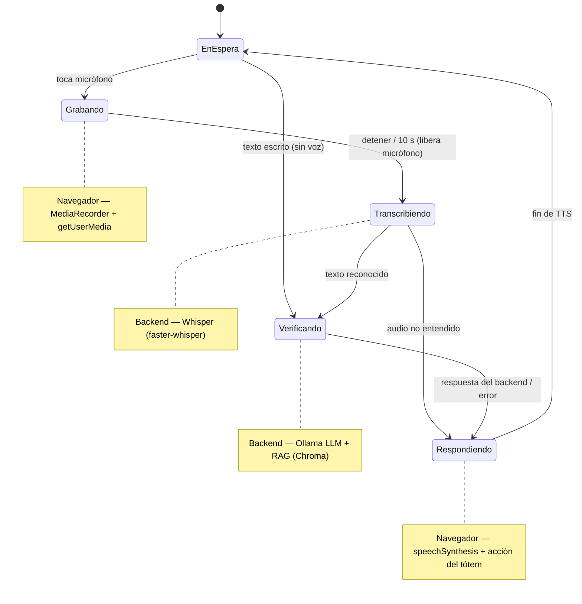

# Frontend — SoftiaGuard Assistant (Tótem)

Interfaz del tótem de control de acceso: una **SPA en React + Vite + Three.js** que muestra al
**Vigilante Virtual** (avatar 3D) y permite al visitante interactuar **por voz o texto**. La voz
—tanto la síntesis (respuesta hablada) como el reconocimiento (micrófono)— se maneja **en el
navegador** con la Web Speech API. Toda la lógica de IA vive en el backend local.

> Parte del proyecto **SoftiaGuard Assistant**. Para levantar el stack completo (frontend +
> backend + Ollama), consulta el [README principal](../README.md).

## Stack

- **React 19** + **Vite 6** + **TypeScript**
- **Three.js** — avatar holográfico (`src/components/VirtualAssistantCanvas.tsx`)
- **Tailwind CSS v4**, **lucide-react** (iconos), **motion** (animaciones)
- **Express** (`server.ts`) — sirve la SPA y **proxya `/api` al backend** (en streaming, soporta audio)
- **`speechSynthesis`** (Web Speech API) — voz de salida (TTS), en el navegador
- **`MediaRecorder` + `getUserMedia`** — graba el audio del micrófono y lo envía a
  `/api/transcribe`; el reconocimiento (STT) ocurre en el backend con **Whisper local**

## Cómo se comunica con el backend

El navegador llama a `POST /api/verify` (ruta relativa, mismo origen). `server.ts` reenvía todo
`/api/*` al backend Python:

```
Navegador ──POST /api/verify──▶ server.ts (Express) ──▶ BACKEND_URL/api/verify
```

- **En Docker**: `BACKEND_URL=http://backend:8000` (definido en `docker-compose.yml`).
- **En local**: por defecto `http://127.0.0.1:8000`. Se usa `127.0.0.1` a propósito, no
  `localhost`, porque Node lo resuelve a IPv6 (`::1`) mientras uvicorn escucha en IPv4.

## Ejecución local (sin Docker)

**Requisitos:** Node.js 20+ y el **backend corriendo** en `http://127.0.0.1:8000`
(ver [backend/README.md](../backend/README.md)).

```bash
npm install
npm run dev          # arranca en http://localhost:3000
```

Abre **http://localhost:3000**. No se necesita ninguna API key (el backend anterior basado en
Gemini fue reemplazado por IA local).

### Con Docker

Se levanta junto al backend desde la raíz del repo con `docker compose up --build`
(ver [README principal](../README.md)).

## Variables de entorno

Copia `.env.example` a `.env` y ajusta según necesites:

| Variable | Por defecto | Descripción |
|---|---|---|
| `BACKEND_URL` | `http://127.0.0.1:8000` | Destino del proxy `/api` (usa `http://backend:8000` en Docker) |
| `VITE_BUILDING_NAME` | `Edificio XYZ` | Nombre del edificio mostrado en la UI |
| `VITE_APP_NAME` | `Asistente de Control de Acceso` | Título de la aplicación |
| `PORT` | `3000` | Puerto del servidor del frontend |

## Scripts

| Comando | Acción |
|---|---|
| `npm run dev` | Servidor de desarrollo con HMR (`tsx server.ts`) |
| `npm run build` | Build de producción (Vite + bundle del servidor a `dist/`) |
| `npm run start` | Sirve el build de producción (`node dist/server.cjs`) |
| `npm run lint` | Chequeo de tipos con `tsc --noEmit` |

## Estructura

```
frontend/
├── server.ts          # Express: sirve la SPA + proxy /api -> backend
├── vite.config.ts     # config de Vite (incluye proxy /api para modo `vite` directo)
├── index.html
└── src/
    ├── App.tsx        # UI y lógica: chat, teclado, voz (TTS/STT), llamada a /api/verify
    ├── components/
    │   └── VirtualAssistantCanvas.tsx   # avatar 3D (Three.js)
    ├── main.tsx       # punto de entrada de React
    └── index.css      # estilos globales (Tailwind)
```

## Notas sobre la voz

- **Salida (TTS)**: usa las **voces del navegador/SO** instaladas para español (`es-VE`/`es-ES`).
  Chrome y Edge suelen tenerlas sin configuración; en otros navegadores puede variar la calidad.
- **Entrada (STT)**: al pulsar el micrófono se graba un clip con `MediaRecorder` y se envía a
  `/api/transcribe`, donde **Whisper local** (faster-whisper) lo transcribe. El audio **no sale a
  ningún servicio externo**. El micrófono se **libera en cuanto se detiene la grabación**
  (`getTracks().forEach(t => t.stop())`), con auto-stop de seguridad a los 10 s.
- `getUserMedia` requiere **contexto seguro**: funciona en `http://localhost:3000`, pero en un
  tótem accedido por IP/dominio necesitarás **HTTPS**.

## Ciclo de estados de la interacción por voz

Al hablar, la UI atraviesa varias fases con feedback visual y hablado en cada una (evita la
sensación de "no se entendió nada" durante el procesamiento):



Feedback por fase (en `src/App.tsx`):

| Estado | Señal en la UI |
|---|---|
| **Grabando** (`isListening`) | barra de ondas animada + "Escuchando… Hable ahora" |
| **Transcribiendo** (`isTranscribing`) | puntos animados + "Entendiendo su mensaje…" |
| **Verificando** (`isProcessing`) | puntos animados + "Verificando su solicitud…" |
| **Respondiendo** | respuesta hablada (TTS) y acción del tótem (portón, QR, intercomunicador) |

Rutas alternas: si escribes en vez de hablar, se salta directo a **Verificando**; si Whisper no
entiende el audio o hay un error de red, el asistente responde con un mensaje de disculpa (texto
y voz) y vuelve a **En espera**.
